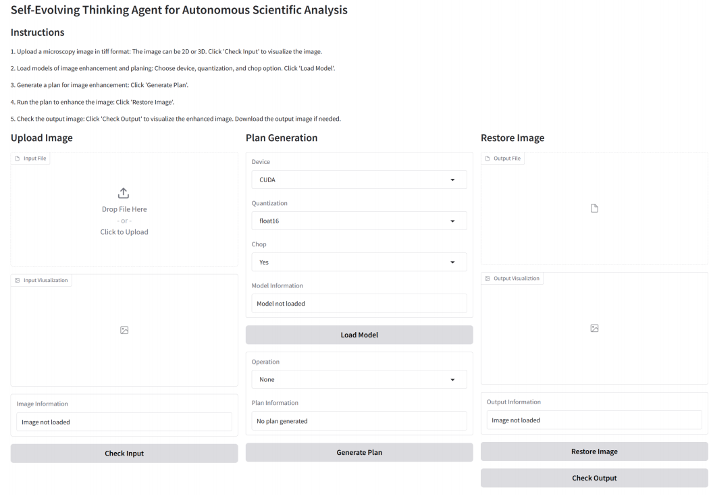

# FMIRAgent



## Web Interface

1. Install Packages

```bash
conda env create -f environment.yaml
conda activate fmiragent
pip install https://github.com/Dao-AILab/flash-attention/releases/download/v2.7.4.post1/flash_attn-2.7.4.post1+cu12torch2.5cxx11abiFALSE-cp310-cp310-linux_x86_64.whl
```

2. Download the [models](https://zenodo.org/records/15254620/files/model.zip).

3. Run the Web Interface

```bash
python app.py --model-path experiment/FMIRAgent
```

## Benchmark

1. Download the [datasets](https://zenodo.org/records/15254620/files/dataset.zip).

2. Test models

```bash
python benchmark.py --model-path experiment/FMIRAgent --dataset-path dataset/test_split/test_dataset_psnr.hf
```